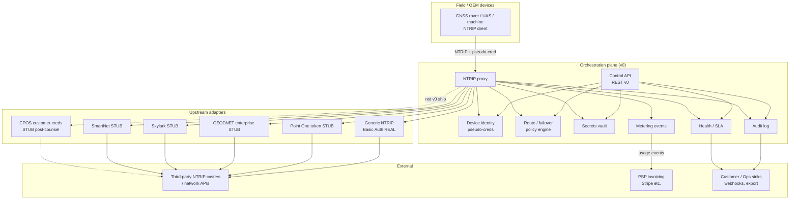

# GNSS RTK OEM/Fleet Correction Orchestration — Architecture

| Field | Value |
| --- | --- |
| **Status** | DRAFT |
| **Date** | 21 Sep 2026 (Europe/Oslo) |
| **Audience** | Builder (Alexander Ness team); Scribe/Ops handoff; director review |
| **Source of truth** | [`/workspace/gnss-rtk-oem-fleet-orchestration-deep-dive.md`](./gnss-rtk-oem-fleet-orchestration-deep-dive.md) — especially §3 (v0 must-haves) and §4 (non-goals) |
| **Sentinel** | CLEAR on architecture (2026-09-21). Holds: screening gate on live org provisioning; CPOS adapter post-counsel only. Soft constraint: GGA/last-position for session health only — no track histories; metering = connect/bytes/device-days only (no location analytics). M0 code held until Alexander picks next move. |

---

## 1. Purpose

This document defines the **v0 software architecture** for a software-only GNSS RTK OEM/fleet **correction orchestration** plane. It sits *above* correction networks and provides:

- Credential vault (master upstream secrets never reach the field)
- Multi-network NTRIP mountpoint routing and failover
- Device identity and provisioning
- Health / SLA telemetry on the correction path
- Audit logs and metering event hooks

It is sold to OEMs, UAS fleets, autonomy stacks, and telematics/SIs — **not** as another end-user survey CORS seat.

**Out of scope for this document:** production code, infra vendor selection as product story, pricing, go-to-market copy. A thin spike is allowed only to clarify a design choice; prefer design over code.

---

## 2. Context & goals

### 2.1 Product (locked)

From the deep-dive exec summary and Builder next-step:

> Design a thin orchestration plane (NTRIP proxy + vault + provisioning + health) that *consumes* public networks (incl. CPOS as optional customer-provided upstream where lawful) without owning base stations.

Closest adjacent peers (for orientation, not feature claims): NL-based **RTK FIX** (credential vault + multi-network API) and CZ-based **Glopos** (white-label caster/reseller ops). Correction *suppliers* (Point One, Skylark, GEODNET, SmartNet, etc.) are upstream feeds — not the same SKU. **OPEN:** bake-off vs RTK FIX API completeness before claiming differentiation.

Do **not** invent market sizes. Price anchors in the deep-dive are for Scout context only; this architecture does not restate or extend them.

### 2.2 v0 must-haves (from deep-dive §3)

| Capability | v0 role |
| --- | --- |
| Credential vault | Encrypt & store provider usernames/passwords/tokens/mountpoints |
| Pseudo / disposable device credentials | Field never sees master login |
| Multi-network NTRIP mountpoint routing | Combine VRS / NEAREST / single-base upstreams via policy |
| Failover policy | Ordered upstreams; health-triggered switch (start: primary/secondary) |
| Device provisioning API | Create/revoke device; assign network profile |
| SLA / health monitoring | Caster reachability, stream rate, last GGA, fix-age proxy |
| Audit logs | Who provisioned / rotated / accessed what |
| Usage metering hooks | Connect-minutes, bytes, device-days → events (not fund custody) |

**v0 nice (design hooks only, not ship blockers):** basic datum/epoch tagging on profiles; team RBAC; coverage pre-check.

### 2.3 Beachhead ICPs (order A → B → C)

Per deep-dive §5: Nordic construction machine-control SIs/OEMs → EU/NO commercial UAS fleet & dock integrators → Nordic ag-autonomy / robot OEMs. Deprioritise Norwegian cadastral survey shops buying CPOS standard seats.

---

## 3. Explicit non-goals

Canonical short list for product docs: [`NON-GOALS.md`](./NON-GOALS.md).

These must remain visible in every Builder/Ops handoff. Spirit of deep-dive §4, plus Sentinel CLEAR holds.

1. **No Kartverket CPOS displacement** — Do not market to Norwegian surveyors as a CPOS alternative; do not undercut CPOS survey pricing; do not claim to replace the national CORS for cadastral/survey workflows. CPOS may appear only as a *customer-supplied upstream* when the customer already holds a lawful subscription. **Complement Kartverket; do not compete.**
2. **No GNSS spoof / jam products or marketing** — No jammers, spoofers, “test spoof kits,” or content that teaches RF attack tradecraft. Reaffirmed (Sentinel CLEAR).
3. **No military guidance / anti-spoof product packaging** — No weapons guidance, munitions, or “military GNSS resilience” SKUs. Dual-use enterprise (ag, construction, civil UAS, robotics) only, with screening. Reaffirmed (Sentinel CLEAR).
4. **No building CORS / base stations as v0** — Software orchestration only; do not become a network operator in v0.
5. **No fund custody / banking licence path** — Metering events + invoice via licensed PSP only (e.g. Stripe). No stored-value wallets, escrow of correction credits as e-money, or payment-institution behaviour. Prepaid “credits,” if ever considered, require counsel — default is subscription + usage invoice.
6. **No live customer/org provisioning until ToS + end-use/sanctions screening exist** *(Sentinel CLEAR hold)* — Design the provisioning API fully; gate **live** org/customer onboarding behind screening readiness. Dev/test fixtures and synthetic orgs are OK. See §11 milestones and §10.
7. **CPOS adapter ships only after counsel on Kartverket ToS** *(Sentinel CLEAR hold)* — Keep customer-supplied CPOS as a **stub / post-counsel** item. v0 may ship **without** a CPOS adapter. Do not block vault/proxy/failover/provisioning/health/audit/metering on CPOS.
8. **No fleet track histories / location analytics** *(Sentinel CLEAR soft constraint)* — GGA / last-position may be used **only** for session health/SLA (e.g. last GGA age, optional region hint for routing). Do **not** retain track histories or build fleet-surveillance-style location products. Metering is connect-minutes / bytes / device-days only — **not** location analytics.
9. **No Lenovo / PGx / SSD product framing; no Hetzner-as-idea** — Infra choice is later Ops; keep it out of the product story.

---

## 4. High-level architecture

### 4.1 Design principles

1. **Consume, don’t operate** — Upstream adapters talk to third-party casters/APIs; we never own base stations in v0.
2. **Master secrets stay in the vault** — Devices authenticate with *pseudo-credentials* issued by us; the proxy binds those to vaulted upstream creds at session time.
3. **Policy decides path** — Route/failover engine selects ordered upstream candidates; proxy executes; health feeds the engine.
4. **Events out, money elsewhere** — Metering emits structured events; invoicing is a PSP concern.
5. **Audit by default** — Provisioning, vault admin, session start/fail/failover, credential rotation are append-only audit records.
6. **Screening before live tenants** — Control-plane APIs for org creation are present but gated until ToS + screening are ready.
7. **Health ≠ surveillance** — GGA/last-position supports session health only; no track retention or location analytics products.

### 4.2 Logical components



### 4.3 Request path (runtime)

1. Device opens NTRIP session to proxy with **pseudo username/password** (and optional mountpoint alias).
2. **Device identity** validates pseudo-cred, resolves `device_id` → `org_id` → **profile** (policy binding).
3. **Policy engine** returns ordered candidate upstreams (primary, secondary, …) filtered by profile, geo hint (if GGA present), and current health.
4. **Vault** yields decrypted upstream secret material to the proxy process only (short-lived in memory).
5. Selected **adapter** opens upstream session (Generic NTRIP Basic Auth first).
6. Proxy relays RTCM (and NMEA GGA upstream if required); **health** samples stream; **metering** emits connect/byte ticks; **audit** records session lifecycle and any failover.
7. On upstream failure or health breach, policy picks next candidate; audit + metering mark the switch.

### 4.4 Control path

OEM/SI (or our admin tooling) uses **REST API** for: orgs (gated), devices, profiles, vault entries (admin), health queries, audit queries. Live org onboarding remains gated per §3.6 / §10 / §11.

---

## 5. Component deep-dives (v0)

### 5.1 NTRIP proxy

**Role:** Terminate device NTRIP (v1/v2 as practical), authenticate pseudo-creds, bind to upstream via adapter, bidirectional relay (GGA up, RTCM down), enforce session limits, emit health/meter/audit signals.

**Responsibilities**

| Concern | Behaviour |
| --- | --- |
| Listen | TLS preferred (`ntrip.<env>:443` or `:2101` with TLS termination at edge). Plain TCP only behind customer VPN — document risk. |
| Auth | HTTP Basic (NTRIP) against **pseudo-cred** store — never against upstream master. |
| Mountpoint | Accept device-facing alias from profile; map to upstream mountpoint via policy (may differ per candidate). |
| GGA | If upstream requires position, forward device GGA; optionally cache last GGA for health. |
| Relay | Stream opaque RTCM; do not parse for positioning logic in v0 (optional lightweight MSM/1005 counters for health later). |
| Limits | Per-device concurrent sessions (default 1); per-org caps (config). |
| Failover | On connect fail, auth reject, or sustained zero-byte window → ask policy for next candidate; reconnect with backoff. |
| Sticky | Prefer sticky primary while healthy; hysteresis to avoid flapping (config: e.g. 30–60s unhealthy before switch). |

**Non-responsibilities:** CORS generation, RTCM transform, datum conversion, L-band.

**Interface sketch (internal)**

```text
ProxySession {
  device_id, org_id, profile_id
  pseudo_user
  selected_upstream_id?
  state: connecting | streaming | failing_over | closed
  bytes_in, bytes_out, started_at, last_gga_at
}
```

**Spike note (optional):** A single-process Go/Rust NTRIP Basic Auth round-trip to a public test caster may clarify TLS/chunked sourcetable behaviour — not required to approve this design.

---

### 5.2 Secrets vault

**Role:** Store upstream network credentials and related secrets; encrypt at rest; release only to authorized proxy/control paths; support rotation without device reflash.

**Secret types (v0)**

| Type | Examples | Notes |
| --- | --- | --- |
| `ntrip_basic` | username, password, optional host override | Generic adapter |
| `bearer_token` | access token, refresh handle | Point One stub → real later |
| `api_key_pair` | appId, appKey | GEODNET stub |
| `opaque_blob` | vendor-specific JSON | Skylark/SmartNet stubs |

**Encryption**

- Envelope encryption: DEK per secret (or per org), KEK in KMS / sealed box key (see §9).
- Ciphertext + IV/nonce + key version stored in DB; plaintext only in proxy memory for session TTL.
- Admin API returns **metadata only** by default (`last4`, `rotated_at`, `provider`); reveal/decrypt is a privileged, audited action (break-glass).

**Operations**

- Create / rotate / disable / delete (soft-delete + retention for audit).
- Bind secrets to **UpstreamEndpoint** records (host, port, mountpoint defaults, adapter_type).
- Never log plaintext; redact in traces.

**CPOS note:** Vault *schema* may allow `provider=cpos` records, but the **CPOS adapter and any live CPOS routing are post-counsel** (§3.7). Storing customer-supplied CPOS secrets before counsel is an **OPEN legal** question — default: do not ingest CPOS secrets until counsel clears.

---

### 5.3 Device identity

**Role:** Map field NTRIP Basic Auth (pseudo-creds) → device → org → profile; lifecycle provision/revoke/rotate.

**Concepts**

| Entity | Meaning |
| --- | --- |
| Org | Tenant (OEM, fleet, SI). Live create gated by screening. |
| Device | One logical rover/aircraft/machine seat. |
| PseudoCredential | Username + password hash (or argon2id); optional expiry; revoke flag. |
| Profile | Named routing policy + optional datum tags + session limits. |

**Provisioning behaviours**

- `POST /v0/devices` → create device + issue pseudo-cred (return secret **once**).
- Rotate pseudo-cred without changing upstream vault entries.
- Revoke → immediate proxy reject on next auth / active session kill.
- Assign/reassign profile (network policy) without touching vault masters.

**Identity guarantees**

- Pseudo username globally unique (or unique per caster realm we expose).
- Password: generate high-entropy; store hash only.
- Optional device labels/tags for OEM fleet dashboards (non-unique).

---

### 5.4 Route / failover policy engine

**Role:** Given device context (+ optional GGA), return an ordered list of upstream candidates and failover rules.

**v0 policy model (simple, explicit)**

```text
ProfilePolicy {
  profile_id
  candidates: [
    { priority: 1, upstream_endpoint_id, mountpoint_override?, min_health?: "ok" }
    { priority: 2, upstream_endpoint_id, ... }
  ]
  failover: {
    unhealthy_after_ms: 30000
    max_switches_per_hour: 10
    on_exhaust: "reject" | "keep_last_best_effort"
  }
  optional: datum_tag, epoch_tag   // labels only in v0; warn, don’t transform
}
```

**Inputs to selection**

- Profile candidates (static order for v0).
- Health snapshot per upstream (reachable, recent stream success rate).
- Optional: country/region hint from last GGA (nice-to-have; geofenced entitlement is later / non-v0).

**Outputs**

- Ordered candidate list for this session attempt.
- Reason codes for audit (`primary_ok`, `primary_unreachable`, `switched_secondary`, …).

**Non-goals for v0 policy:** ML routing, full datum transform, commercial plan commerce, geofenced entitlement enforcement (later).

---

### 5.5 Metrics / audit

**Split two buses mentally even if one store initially.**

#### Health / SLA metrics (operational)

| Signal | Source | Use |
| --- | --- | --- |
| Upstream TCP/TLS connect success | Proxy / probe | Candidate eligibility |
| Auth success/fail upstream | Adapter | Alert / failover |
| Bytes/sec RTCM down | Proxy | Stream liveliness |
| Last GGA age | Proxy | Device still sending position (health only) |
| Last position (ephemeral) | Proxy | Optional region hint / upstream eligibility — **not** retained as a track |
| Session count | Proxy | Capacity |
| Failover events | Policy+Proxy | SLA narratives |

**Privacy soft constraint (Sentinel):** retain at most *last* GGA / last-position sample for live session health (and drop or overwrite when the session ends). Do **not** store trajectories, breadcrumbs, or historical position series. Do not productize location analytics.

Expose: `GET /v0/health/upstreams`, `GET /v0/health/devices/{id}`, org rollup. Push optional webhooks later.

#### Audit log (compliance / enterprise)

Append-only records, immutable to API clients:

| Event examples | Fields (min) |
| --- | --- |
| `org.screening_*` | org_id, actor, result, at |
| `vault.secret.created/rotated/disabled` | secret_id, actor, at |
| `device.provisioned/revoked/cred_rotated` | device_id, actor, at |
| `session.started/ended/failover` | device_id, upstream_id, reason, at |
| `admin.break_glass_reveal` | secret_id, actor, at |

Retention: **OPEN** (Ops + counsel); design for export. Query hooks: filter by org, device, time, event_type (§7).

---

### 5.6 Metering events

**Role:** Emit usage facts for later invoicing — **not** balances, wallets, or custody. **Not** location analytics (Sentinel soft constraint).

**Event types (v0)** — connect / bytes / device-days only:

| Event | Suggested fields |
| --- | --- |
| `usage.session_started` | org_id, device_id, session_id, upstream_id, ts |
| `usage.session_ended` | session_id, duration_ms, bytes_up, bytes_down, end_reason |
| `usage.tick` (optional) | session_id, delta_bytes, delta_ms (periodic) |
| `usage.device_day` (rollup job) | org_id, device_id, day, active_seconds |

**Forbidden in metering events:** lat/lon, NMEA GGA payloads, track points, geofence histories, or any field that would turn usage into location analytics.

**Delivery**

- Persist to append-only store / queue.
- Export: webhook signed JWT/HMAC, or batch CSV/JSON to customer billing system.
- PSP (Stripe etc.) consumes *our* invoice line generation — we do not hold customer float.

**Non-goals:** e-money credits, reseller clearing of third-party network fees as principal (pass-through invoicing patterns = **OPEN** with counsel); location-based billing or analytics.

---

## 6. Upstream adapter model

### 6.1 Adapter interface (logical)

```text
Adapter {
  type: "ntrip_basic" | "point_one_token" | "geodnet_enterprise"
        | "skylark" | "smartnet" | "cpos_customer"

  connect(ctx, UpstreamEndpoint, SecretMaterial, SessionHints) -> UpstreamSession
  // SessionHints: mountpoint, gga, user_agent

  UpstreamSession {
    write_gga(nmea)
    read_rtcm() -> stream
    close()
    health_sample()
  }
}
```

All adapters called only from the proxy after vault release. Control plane never opens long-lived correction streams.

### 6.2 First: Generic NTRIP Basic Auth (**real design**)

| Item | Spec |
| --- | --- |
| Transport | TCP or TLS to `host:port` (often 2101 / 443) |
| Auth | HTTP Basic on NTRIP request (v1) or NTRIP v2 as supported |
| Request | `GET /{mountpoint}` with `Ntrip-Version` / `User-Agent` as required by caster |
| Body | Optional GGA; then RTCM stream |
| Sourcetable | Optional admin/probe path for mountpoint discovery — not required for every session |
| Secret | `ntrip_basic`: username, password |
| Failure mapping | DNS/TCP fail → `unreachable`; 401/403 → `auth_failed`; idle timeout → `stalled` |

This adapter covers the majority of regional nets and many commercial casters that still expose classic NTRIP. It is the **v0 ship path**.

### 6.3 Stub designs (interfaces only; no production integration)

| Adapter | Auth model (public/docs-level) | Stub behaviour | Ship gate |
| --- | --- | --- | --- |
| **Point One** | Native auth → token; RTCM via TLS host (docs in deep-dive refs) | Implement interface; return `not_implemented` or fixture stream in test | After token-lifecycle design + account |
| **GEODNET** | Enterprise API (`appId`/`appKey`) + NTRIP | Stub client methods for user/coverage; session path TBD | After enterprise API access |
| **Skylark** | NTRIP client config + fleet/license API (sales/docs) | Stub endpoint + mountpoint Nx/Cx style aliases | After OEM agreement |
| **SmartNet** | Open NTRIP + portal admin | Often fits **generic NTRIP** with customer creds; dedicated stub only if portal API needed | Prefer generic first |
| **CPOS (customer-supplied)** | Classic NTRIP with customer Kartverket credentials | **Stub only.** No live connect until counsel reviews Kartverket ToS / proxying legality | **Post-counsel** (Sentinel CLEAR). Not a v0 ship dependency |

**SmartNet note:** Many SmartNet deployments are reachable via generic NTRIP Basic Auth using customer-supplied seats — treat “SmartNet adapter” as thin preset (default hosts/mountpoint conventions) over the generic adapter unless a portal API is required.

**CPOS note:** Do not block M0–M2 on CPOS. Document stub in codebase/docs so SIs see the *intent* to support customer-owned CPOS later, without enabling it.

---

## 7. API sketch (primary: REST)

### 7.1 Why REST for v0

Small team, thin control plane, easy OpenAPI generation, straightforward RBAC middleware later. GraphQL (Point One style) is a fine *later* addition for OEM-complex queries; it is not required to prove the wedge. **Primary: REST/JSON + OpenAPI 3.** Webhooks for audit/metering push.

Base: `https://api.<env>/v0`

Auth: API keys or OAuth2 client-credentials for machine tenants; human admin sessions later. All mutating calls audited.

### 7.2 Resources (sketch)

#### Orgs (gated)

```http
POST   /v0/orgs                    # LIVE: requires screening_ready; else 403 screening_required
GET    /v0/orgs/{org_id}
PATCH  /v0/orgs/{org_id}
POST   /v0/orgs/{org_id}/screening  # Ops: record screening result (internal)
```

Dev/test: header or env `X-Allow-Fixture-Orgs: true` only in non-prod.

#### Devices / identity

```http
POST   /v0/orgs/{org_id}/devices
GET    /v0/orgs/{org_id}/devices
GET    /v0/devices/{device_id}
PATCH  /v0/devices/{device_id}          # labels, profile_id, enabled
POST   /v0/devices/{device_id}/credentials:rotate
POST   /v0/devices/{device_id}:revoke
```

`POST devices` response includes one-time `pseudo_username` + `pseudo_password`.

#### Profiles (route policy)

```http
POST   /v0/orgs/{org_id}/profiles
GET    /v0/orgs/{org_id}/profiles
GET    /v0/profiles/{profile_id}
PUT    /v0/profiles/{profile_id}        # replace candidates + failover
```

#### Vault (admin)

```http
POST   /v0/orgs/{org_id}/upstreams
GET    /v0/orgs/{org_id}/upstreams
GET    /v0/upstreams/{upstream_id}      # metadata only
POST   /v0/upstreams/{upstream_id}/secrets
POST   /v0/upstreams/{upstream_id}/secrets:rotate
POST   /v0/upstreams/{upstream_id}/secrets:disable
# break-glass (privileged, audited):
POST   /v0/upstreams/{upstream_id}/secrets:reveal
```

Reject `adapter_type=cpos_customer` connect paths until feature flag `cpos_adapter_enabled` (default false).

#### Health

```http
GET    /v0/orgs/{org_id}/health
GET    /v0/upstreams/{upstream_id}/health
GET    /v0/devices/{device_id}/health
GET    /v0/orgs/{org_id}/sessions?status=active
```

#### Audit query hooks

```http
GET    /v0/orgs/{org_id}/audit?from=&to=&event_type=&device_id=&cursor=
```

#### Metering hooks

```http
GET    /v0/orgs/{org_id}/usage/events?from=&to=&cursor=
POST   /v0/orgs/{org_id}/usage/webhooks   # register sink
```

No `/wallet`, `/credits/balance`, or payout endpoints.

---

## 8. Data model sketch

### 8.1 Entities (key fields)

```text
Org
  id, name, status: fixture|pending_screening|active|suspended
  screening_status, screening_at, screening_reference
  created_at

Device
  id, org_id, profile_id?, label, tags[]
  status: active|revoked
  created_at, revoked_at?

PseudoCredential
  id, device_id
  username                # unique
  password_hash           # argon2id
  expires_at?, revoked_at?
  version                 # increment on rotate

Profile
  id, org_id, name
  policy_json             # ProfilePolicy (§5.4)
  datum_tag?, epoch_tag?  # labels only
  created_at

UpstreamEndpoint
  id, org_id
  adapter_type            # ntrip_basic | point_one_token | ... | cpos_customer
  display_name
  host, port, use_tls
  default_mountpoint?
  options_json            # vendor extras
  enabled

VaultSecret
  id, upstream_id
  secret_type             # ntrip_basic | bearer_token | ...
  ciphertext, nonce, key_version
  last4?, rotated_at, disabled_at?
  # never plaintext column

Session (ephemeral or short retention)
  id, device_id, org_id, profile_id
  upstream_id?, started_at, ended_at?
  bytes_up, bytes_down, end_reason
  failover_count

HealthSample
  upstream_id | device_id, ts, ok, metrics_json

AuditEvent
  id, org_id?, actor_type, actor_id
  event_type, resource_type, resource_id
  payload_json, ts
  # append-only

MeteringEvent
  id, org_id, device_id?, session_id?
  event_type, payload_json, ts
```

### 8.2 Encryption notes

- **VaultSecret:** AES-256-GCM (or libsodium secretbox) with envelope encryption; KEK in cloud KMS or age/SOPS-sealed key for early single-tenant — migrate to KMS before multi-tenant prod.
- **PseudoCredential:** hash only (argon2id); TLS in transit for issuance.
- **Backups:** encrypted; vault key access dual-controlled where practical.
- **CPOS secrets:** do not store until counsel clears proxying (§3.7).

---

## 9. Suggested stack (small team, pragmatic)

Optimise for a small Builder team shipping a correct thin plane — not for a particular hoster brand.

| Layer | Suggestion | Rationale |
| --- | --- | --- |
| **Proxy / data plane** | **Go** or **Rust** | Long-lived TCP, low overhead, good TLS story. Go slightly faster to staff for many teams. |
| **Control API** | **Go** (same repo) or **TypeScript (Node/Fastify)** | If split: TS for OpenAPI speed; if unified: Go everywhere. Prefer **one language** until M2. |
| **Datastore** | **PostgreSQL** | Orgs, devices, profiles, vault ciphertext, audit, metering. Use JSONB for policy_json. |
| **Queue / async** | **NATS** or **Postgres LISTEN/NOTIFY + worker** initially; **Redis Streams** acceptable | Avoid Kafka until volume demands it. |
| **Secrets KEK** | Cloud **KMS** (AWS KMS / GCP KMS / Azure Key Vault) in prod; **SOPS/age** for dev | Envelope encryption (§8.2). |
| **Object export** | S3-compatible bucket for audit/usage dumps | |
| **Edge TLS** | Managed load balancer / Caddy / Traefik | Terminate TLS; proxy may also speak TLS upstream. |
| **Observability** | OpenTelemetry → Grafana/Prometheus; structured JSON logs | Health SLIs from §5.5 |
| **Deploy shape** | Container images; **single region** EU (data residency preference for NO/EU ICP); compose or small k8s later | Blue/green or rolling for API; sticky-less proxy replicas behind LB with shared PG. |
| **CI** | OpenAPI lint, unit tests, adapter contract tests with recorded fixtures | |
| **PSP** | Stripe (or EU-friendly PSP) for invoices only | No custody |

**Explicitly deferred:** multi-region active-active, white-label portal UI, GraphQL gateway.

---

## 10. Security & compliance notes

### 10.1 Baseline

- TLS everywhere on public endpoints; HSTS at edge.
- Pseudo-creds only on devices; vault masters never in firmware/OEM docs.
- Least-privilege DB roles; proxy role can decrypt via KMS grant scoped to vault keys.
- **RBAC:** v0 may be single-admin API keys per org; design tables for roles (`org_admin`, `operator`, `read_only`) — **RBAC UI later OK**.
- Rate-limit auth failures; lockout / alert on credential stuffing against proxy.

### 10.2 Audit & retention

- All vault and provisioning mutations audited (§5.5).
- Session failover reasons retained for SLA disputes.
- Retention period: **OPEN** (counsel/Ops).

### 10.3 End-use screening hooks *(Sentinel CLEAR)*

Must land in ToS & sales playbooks before **live** org activation:

- Customer represents lawful civil/commercial end use (agriculture, construction, surveying support for machines, civil UAS, robotics, research).
- Prohibited: unauthorized surveillance, criminal activity, military weapons guidance, GNSS interference (jam/spoof), sanctions-violating destinations/parties.
- Right to suspend credentials on credible misuse; retain audit logs for compliance review.
- Export-control / sanctions screening on org identity where applicable (EU/NO).
- Customer remains responsible for upstream network ToS (incl. Kartverket CPOS terms if/when they bring CPOS credentials).

**Engineering gate:** `Org.status` cannot become `active` unless `screening_status=cleared` (or equivalent). Fixture orgs exempt in non-prod only.

### 10.4 Funds

No holding customer funds; metering + PSP invoice only (§3.5).

### 10.5 Reaffirmations

- No spoof/jam products or marketing.
- No military guidance / anti-spoof packaging.
- No track-history retention; GGA/last-position for session health/SLA only.
- Metering = connect / bytes / device-days only — not location analytics.

---

## 11. First milestone plan (M0–M3)

| Milestone | Outcomes | Real vs stub |
| --- | --- | --- |
| **M0 — Design freeze & skeleton** | This architecture accepted; OpenAPI stub published; repo layout (proxy, api, migrations); threat/screening checklist drafted with Ops/counsel. **No live customer orgs.** | Docs + empty adapters; fixture org flag for local dev |
| **M1 — Vertical slice (generic NTRIP)** | Vault encrypt/decrypt path; device pseudo-cred provision (fixture org); NTRIP proxy authenticates pseudo-cred and relays via **generic NTRIP Basic Auth** to a test/public caster; session audit + basic health samples; metering events written to PG. | **Real:** vault, identity, proxy, generic adapter, audit/meter writers. **Stub:** Point One, GEODNET, Skylark, SmartNet preset, **CPOS**. **Gated:** live org POST → `403 screening_required` |
| **M2 — Failover + ops visibility** | Profile policy primary/secondary; health-triggered failover with hysteresis; health API; audit query API; usage export endpoint/webhook; load test concurrent sessions (target **OPEN**). ToS draft + screening workflow runbook in progress. | **Real:** policy engine, health, audit query, metering export. **Still stub:** vendor-specific adapters, CPOS. **Still gated:** live onboarding |
| **M3 — Screening unlock & first tenants** | ToS + end-use/sanctions screening **live**; first carefully screened pilot org(s) (ICP A preferred); RBAC basics (API key roles); runbooks for rotate/revoke/suspend. Optional: start Point One **or** GEODNET adapter spike if pilot needs it. | **Real:** screening gate opens for pilots. **CPOS adapter:** only if counsel has cleared; otherwise remains stub and pilots use generic/commercial upstreams they already own |

**Explicit non-dependencies for M1–M2:** CPOS adapter, white-label portal, GraphQL, own CORS, PSP go-live (events only until invoicing needed).

**Sentinel holds baked in:** no live customer/org provisioning before screening; CPOS post-counsel; no spoof/jam or mil packaging anywhere in milestones; no track histories / no location metering. **M0 code held until Alexander picks next move** (director 2026-09-21).

---

## 12. Open questions / dependencies

Do **not** invent answers; track owners.

| ID | Question | Owner hint |
| --- | --- | --- |
| O1 | Kartverket CPOS ToS — is credential proxying / NTRIP relay by a third-party orchestration plane permitted when customer supplies their own CPOS seats? | Counsel → unlock CPOS adapter |
| O2 | Bake-off: RTK FIX API completeness vs our v0 (credential proxy behaviour, concurrent session limits, EU data residency claims). | Scout/Builder |
| O3 | Enterprise list prices (RTK FIX, Glopos, Point One, Skylark, SmartNet NO) — unpublished; NDA/quote only. | Scout/Ops |
| O4 | SmartNet Norway portal SKUs — contact Leica Geosystems AS; do not invent NOK list. | Scout |
| O5 | Structure of any future “credits” so we never hold e-money. | Counsel |
| O6 | Audit/usage retention periods and cross-border transfer terms for EU/NO tenants. | Counsel + Ops |
| O7 | NTRIP v1 vs v2 must-support matrix for beachhead OEM receivers. | Builder spike optional |
| O8 | Target concurrent sessions / latency budget for M2 load test. | Builder + director |
| O9 | Screening provider / manual Ops process for M3 org activation. | Ops |
| O10 | Whether storing CPOS secrets (even disabled) is allowed pre-counsel — default **no**. | Counsel |

---

## 13. References

- **Source of truth (product wedge, §3 must-haves, §4 non-goals, ICP order):** [`/workspace/gnss-rtk-oem-fleet-orchestration-deep-dive.md`](./gnss-rtk-oem-fleet-orchestration-deep-dive.md)
- Deep-dive Appendix A — primary vendor/docs URLs (Point One, Skylark, GEODNET, SmartNet, RTK FIX, Glopos, Kartverket CPOS, BKG NTRIP, RTCM)
- Deep-dive Appendix B — open items (prices, bake-off, legal credits/CPOS)
- Sentinel CLEAR (21 Sep 2026): screening gate on live org provisioning; CPOS adapter post-counsel; reaffirm no spoof/jam and no military guidance packaging

---

## Document control

| Version | Date | Notes |
| --- | --- | --- |
| 0.1 DRAFT | 21 Sep 2026 (Europe/Oslo) | Initial Builder architecture from deep-dive §3/§4 + Sentinel CLEAR holds |

*End of architecture DRAFT. Implement from M0; respect non-goals; do not enable CPOS or live tenant onboarding until gates clear.*
